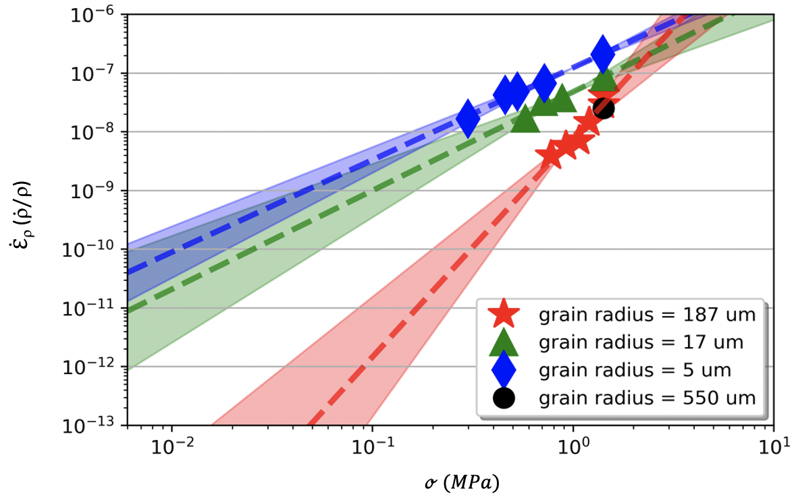
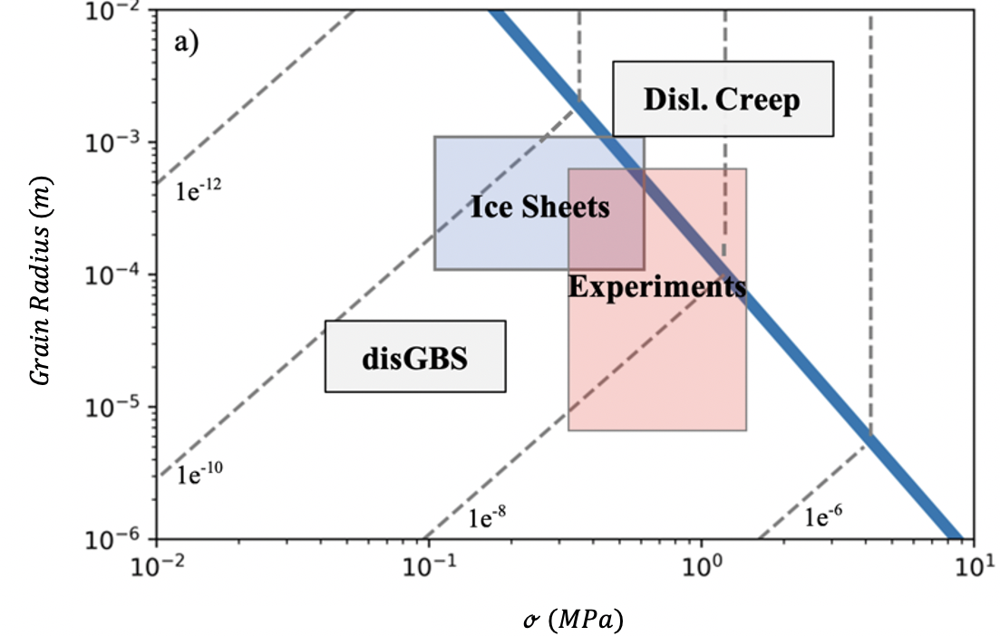

## The Rheological Behavior of Firn: Experimental Observations of Grain Size Sensitivity and Application to Ice Sheet Deformation

*How does grain size, strain state, and microstructure influence the rheological behavior of ice compaction among glaciers and ice sheets?*

**[`Firn_notebook.ipynb`](https://nbviewer.jupyter.org/github/daniel-furman/Furman-and-Goldsby/blob/master/Firn_notebook.ipynb)**

 
Experimental results | Flow model for Antarctica (densification rate)
:-------------------------------------------:|:------------------------------:
 | 

### Introduction

---

Ice physics and flow processes in the near-surface of ice sheets. All code and data required to reproduce analyses presented in Furman and Goldsby, 2021.

**Key Points**
* Constant stress laboratory experiments were performed on H20 ice powder samples with roughly uniform grain size varying from 5 to 550 micrometers (µm) in radius. 
*	Two rheologically-distinct creep regimes emerged, characterized by their grain size sensitivity and stress dependence: dislocation creep (n ~ 3.7, p ~ 0) and disGBS (n ~ 1.6, p ~ 0.9). 
*	Flow laws resolved the disGBS mechanism as predominantly rate-limiting for natural conditions, such as in glaciers and ice sheets.  

**Key Words** 
*	Ice sheets, glaciers, firn densification, microstructure, grain size sensitivity, dislocation creep, disGBS, the field boundary hypothesis, constant-stress creep tests

**Plain Language Summary** 

Vast deposits of partially dense ice, or firn, form layers in the near-surface of glaciers and ice sheets on earth and in space. To determine the flow properties for these ice bodies, we produced and then deformed samples of ice powder in the laboratory, a controlled setting wherein we isolated (and varied) particular physical variables. Experiments were conducted in the freezer and took anywhere between two hours to fourteen days in total, depending on the rate of deformation. We found that the ice compaction rates were independent of grain size at coarser grain sizes. However, among finer grain sizes, we discovered a mechanism directly sensitive to grain size, meaning that samples composed of ultra-fine grains flowed more rapidly than samples of fine grains. Grain size sensitivity for firn should be further tested and, upon future consensus review, included in glaciological models.

### Data

---

Output from compaction tests (compaction*.csv) and pressure-density profiles (site-name*.csv) are contained in the data/ subfolder. 

### Workflow

---

The programming workflow is available in [`Firn_notebook.ipynb`](https://nbviewer.jupyter.org/github/daniel-furman/Furman-and-Goldsby/blob/master/Firn_notebook.ipynb), where each .py script is ran in an easy to follow sequence.

### Paper Figures

---

Figure 1: From (a) [Breant et al. (2017)](https://doi.org/10.5194/cp-13-833-2017) (their Figure 3) and (b) [Faria et al. (2014)](https://doi.org/10.1016/j.jsg.2013.11.003) (their Figure 7).   
Figure 2: `flow_law_fiting.py`   
Figure 3: `dens_multiweek.py`   
Figure 4: `mechanism_maps.py`   
Figure S1: Photographs taken in the laboratory and diagram made with PowerPoint   
Table 1: `flow_law_fitting.py`   
Table S1: `calc_dens_rates.py`   

